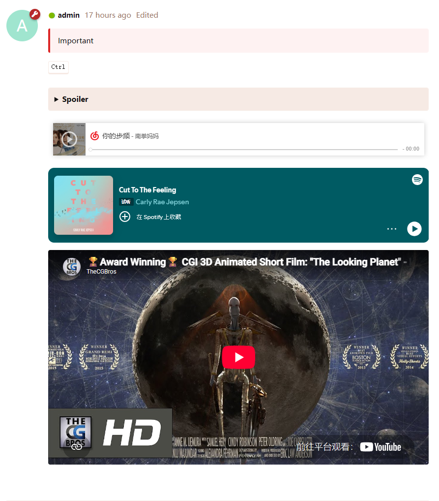

# FFans BBcode Studio

[](https://packagist.org/packages/ffans/bbcode-studio)
[](https://docs.flarum.org)
[](https://github.com/FFans/bbcode-studio/releases)
[](https://github.com/FFans/bbcode-studio/releases)
[](https://packagist.org/packages/ffans/bbcode-studio)
[](https://packagist.org/packages/ffans/bbcode-studio)

A [Flarum](https://flarum.org/) extension. Create and manage custom s9e TextFormatter-based BBCode and media embed rules.

This extension was developed with AI assistance. Custom rendering rules can load third-party content, so administrators should review the service provider's privacy policy before enabling them.

## Preview



## Features

- Includes Bilibili, YouTube, Vimeo, Spotify and NetEase Cloud Music media embed rules, disabled by default.
- Includes Notice, Spoiler, and KDB BBCode rules, disabled by default.
- Create, edit, reorder, enable, disable, delete, and test custom BBCode and media embed rules in the administration dashboard.
- Create a composer button and default inserted content for each BBCode.
- Custom BBCode
  - Custom BBCode rules define an s9e TextFormatter usage and rendering template, which are compiled and checked before saving.
  - Custom BBCode roots receive `BbcodeStudio-bbcode` and `BbcodeStudio-bbcode-{tag}` classes for category-wide or per-rule styling.
  - Custom BBCode can configure default tag attributes inserted by its composer button.
- Media embeds
  - Media embeds define PHP PCRE-based rules that extract resource identifiers from URLs, along with player dimensions.
  - Media roots receive `BbcodeStudio-media` and `BbcodeStudio-media-{tag}` classes for category-wide or per-rule styling.
  - Recognition rules are divided into **Direct extraction** and **Short-link redirect**. Because short links do not contain the platform resource identifier, the backend records the redirected URL when a post is saved and then processes it with the extraction rules.
  - Once a media embed is enabled, matching links in posts are automatically converted into responsive players. BBCode usage can also be enabled separately.
  - Media rules can configure iframe attributes: `allowfullscreen` supports forms with or without a value, while `allow`, `referrerpolicy`, and `scrolling` require values.

## Requirements

| Flarum version | Extension version | Branch |
|----------------|-------------------|--------|
| 2.x            | `2.x`             | `2.x`  |

## Installation

Install with Composer:

```sh
composer require ffans/bbcode-studio
php flarum cache:clear
```

Enable the extension in the Flarum Dashboard.

## Updating

```sh
composer update ffans/bbcode-studio
php flarum migrate
php flarum cache:clear
```

## How it works?

Short-link redirects follow at most three redirects. Only short-link domains detected from the rule may be contacted, and the final URL must belong to a source domain defined by the same media rule. Successful results are cached for 30 days and failures for 5 minutes. Viewing a published post does not request the short-link service again.

Rule changes automatically flush the formatter cache. Existing posts are not updated.

## Translations

English (`en`) and Simplified Chinese (`zh-Hans`) are included.

Help translate this extension into other languages on [Robert Korulczyk's Weblate](https://weblate.rob006.net/projects/flarum2/ffans-bbcode-studio/).

## Links

- [GitHub](https://github.com/FFans/bbcode-studio)
- [Packagist](https://packagist.org/packages/ffans/bbcode-studio)
- [Discuss](https://discuss.flarum.org/d/39753)
- [Discuss in Chinese](https://discuss.flarum.org.cn/d/16554)

## License

This project is released under the [MIT License](https://github.com/FFans/bbcode-studio/blob/2.x/LICENSE).
