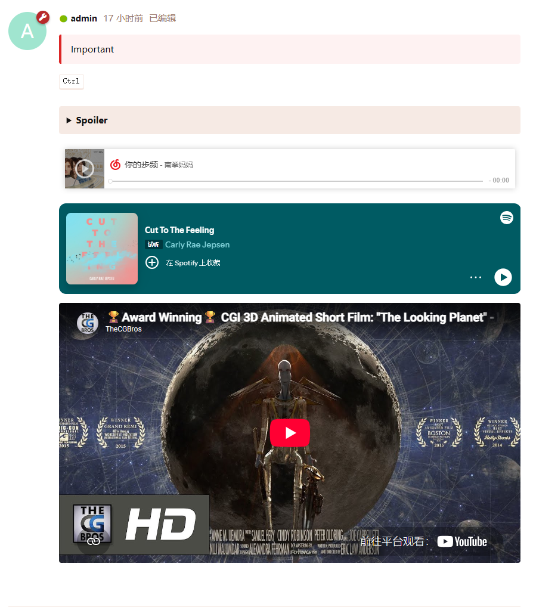

# FFans BBcode Studio

[](https://packagist.org/packages/ffans/bbcode-studio)
[](https://docs.flarum.org/)
[](https://github.com/FFans/bbcode-studio/releases)
[](https://github.com/FFans/bbcode-studio/releases)
[](https://packagist.org/packages/ffans/bbcode-studio)
[](https://packagist.org/packages/ffans/bbcode-studio)

为 [Flarum](https://flarum.org/) 创建和管理自定义基于 s9e TextFormatter 的 BBCode 和媒体嵌入规则。

本扩展在开发过程中使用了 AI 辅助。自定义渲染规则可以加载第三方服务内容，启用前请管理员检查服务提供方的隐私政策。

## 效果预览



## 功能

- 内置默认不启用的 Bilibili、YouTube、Vimeo、Spotify 和网易云音乐媒体嵌入规则。
- 内置默认不启用的 Notice、Spoiler、KDB BBCode。
- 在管理后台创建、编辑、排序、启用、停用和删除自定义 BBCode 与媒体嵌入规则，并进行测试验证。
- 为每个 BBCode 创建编辑器按钮，以及默认的填充内容。
- 自定义 BBCode
  - 自定义 BBCode 规则需定义 s9e TextFormatter 用法和渲染模板，保存前会进行编译与模板检查。
  - 自定义 BBCode 根元素带有 `BbcodeStudio-bbcode` 和 `BbcodeStudio-bbcode-{tag}`，便于分类或按规则控制样式。
  - 自定义 BBCode 可以配置默认填充的标签属性。
- 媒体嵌入
  - 媒体嵌入需定义基于 PHP PCRE 正则的 URL 标识提取规则、播放器尺寸。
  - 媒体根元素带有 `BbcodeStudio-media` 和 `BbcodeStudio-media-{tag}`，便于分类或按规则控制样式。
  - 提取规则分为“直接提取”和“短链跳转”。短链中不包含平台资源标识，因此无法直接播放，保存帖子时会由后端记录跳转后的 URL，并根据提取规则处理。
  - 媒体嵌入启用后，即可自动识别帖子中的链接，并转为响应式播放器。你也可以额外启用 BBCode 用法。
  - 可为媒体规则配置 iframe 属性：`allowfullscreen` 支持无值或带值写法，`allow`、`referrerpolicy` 和 `scrolling` 使用带值写法。

## 环境要求

| Flarum 版本 | 扩展版本 | 分支  |
|-------------|----------|-------|
| 2.x         | `2.x`    | `2.x` |

## 安装

通过 Composer 安装：

```sh
composer require ffans/bbcode-studio
php flarum cache:clear
```

在 Flarum 管理后台启用本扩展。

## 更新

```sh
composer update ffans/bbcode-studio
php flarum migrate
php flarum cache:clear
```

## 运行机制

短链跳转最多三次，只允许访问规则中识别出的短链域名，并且最终地址必须属于同一模板定义的来源域名。成功结果缓存 30 天，失败结果缓存 5 分钟。阅读已发布帖子不会再次请求短链服务。

规则发生变化后会自动刷新格式化器缓存。历史帖子不会被更新。

## 翻译

扩展内置英文（`en`）和简体中文（`zh-Hans`）。

帮助翻译其他语言，请前往 [Robert Korulczyk's Weblate](https://weblate.rob006.net/projects/flarum2/ffans-bbcode-studio/)。

## 相关链接

- [GitHub](https://github.com/FFans/bbcode-studio)
- [Packagist](https://packagist.org/packages/ffans/bbcode-studio)
- [英文社区](https://discuss.flarum.org/d/39753)
- [中文社区](https://discuss.flarum.org.cn/d/16554)

## 许可证

本项目基于 [MIT 许可证](https://github.com/FFans/bbcode-studio/blob/2.x/LICENSE) 发布。
